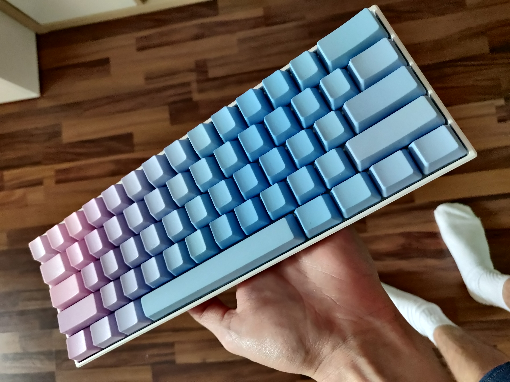
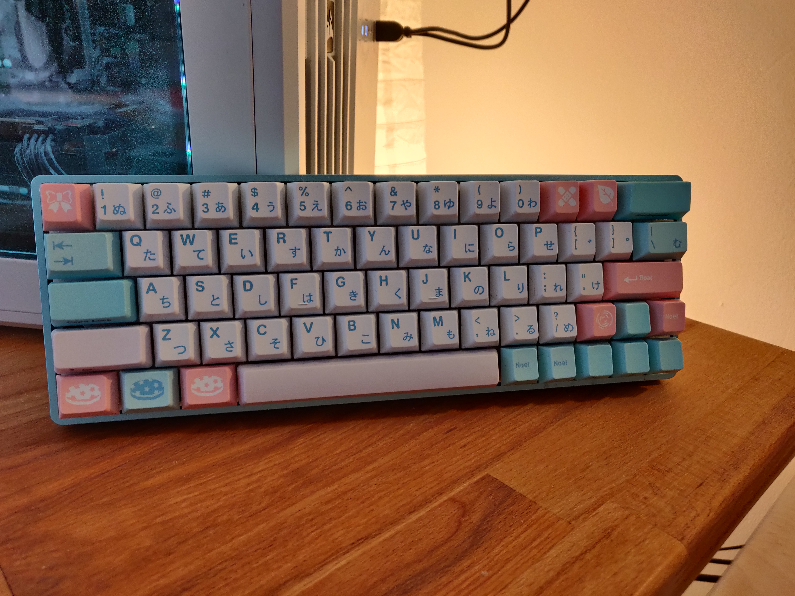
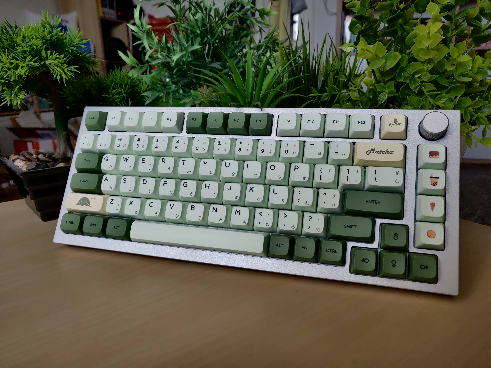

## Mechanical Keyboards
Ever since I bought my first keeb, I'm in love with them and can never go back
to a normal pre-built one.
But I'm just a beginner, so go easy on me.

### 60%
#### Anne Pro 2
My first ever (and yes I know, pre-built) mechanical keyboard, with _Kailh Red_
and _DROP PBT Blank Gradient caps_.

#### DZ60
My first DIY keyboard with _Trybosys_ lubed _Gateron Yellows_ with _GMK Noel_.
Whilst not being perfect in the slightest, I'm really proud how it turned out.

* * *

### 65%
#### KBDLite67 R2 Tiffany
My current master piece with lubed _Akko Matcha_ Switches and _ePBT Green & White_
caps.

* * *

### 75%
#### GMMK Pro
My first shot at a bigger keyboard was the _GMMK Pro_ with lubed _Akko Matcha_ switches
and _ZDA Matcha_ keycaps.

